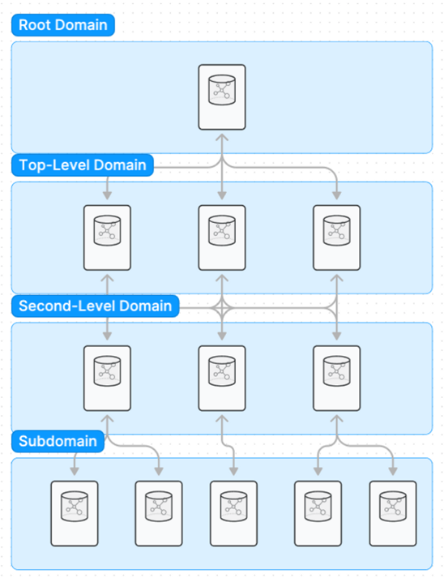
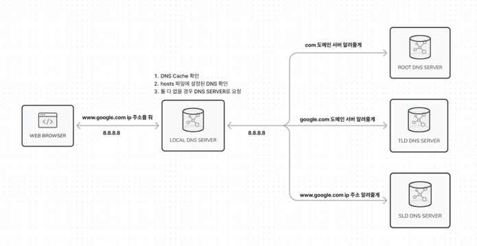
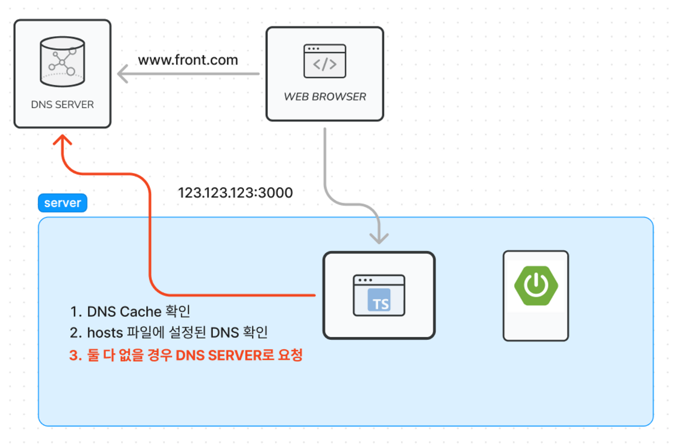
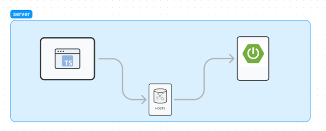

# 개요

프론트엔드 서버와 백엔드 서버를 배포하고 DNS에 등록하여 웹 사이트를 띄우는 작업을 하던 중 아래의 이슈를 마주했습니다.

- https://www.front.com - 백엔드와의 통신이 되지 않는다.
- https://www.front.com/page/1 - 백엔드와 정상적으로 통신이 됨.

프론트엔드에서는 백엔드의 엔드포인트를 아래와 같이 설정했습니다.

```java
https://www.back.com/ // 백엔드 서버의 도메인
```

두 페이지의 차이는 CSR과 SSR이였습니다. 프론트엔드 프로젝트에선 SEO를 향상시키기 위해 홈페이지를 렌더링할 때 SSR 즉, 서버에서 웹 페이지를 만들어서 응답을 하고 있습니다. 반면 다른 페이지들은 클라이언트에서 데이터가 필요할 때 서버의 API로 요청을 하도록 구성되어 있습니다. SSR을 할 때 어떤 문제가 발생하는 것 입니다.

## 해결 방법

```java
// hosts
127.0.0.1     https://www.back.com
```

해결 방법부터 말씀드리면 linux 기반의 운영체제를 기준으로 `/etc/hosts` 파일에 위 내용을 추가하면 됩니다. 위 내용을 추가했을 때 서버 간 통신이 어떻게 변하는지 DNS에 대한 설명과 더불어 설명드리겠습니다.

## DNS의 동작 원리(PC에서 도메인 주소로 검색하면 생기는 일)

DNS는 컴퓨터 간의 통신 시 사람이 이해하기 쉬운 이름(www.naver.com)을 컴퓨터의 IP 주소로 변환하는 시스템입니다. 전세계적인 거대한 분산 시스템입니다.

### 구성 요소

1. 도메인 네임 스페이스
2. 네임 서버(권한 있는 DNS 서버)
3. 리졸버(권한 없는 DNS 서버)

`도메인 네임 스페이스`는 이러한 DNS가 저장 관리하는 계층적 구조를 의미합니다. 최상위에 루트 DNS 서버가 존재하고 하위로 연결된 노드가 연속해서 이어진 계층 구조로 되어 있습니다.(폴더 구조, 트리 구조)



도메인 네임 스페이스의 트리 구조에 대한 정보가 필요합니다. 이러한 정보를 가지고 있는 서버를 `네임 서버(DNS 서버)`라고 부릅니다. DB 역할, 찾아주는 역할, 요청 처리 응답이 구현되어 있습니다.

1. `Root DNS 서버`: 전 세계에 13개 있는 서버로 TLD DNS 서버 IP 주소를 저장하고 안내하는 역할을 합니다.
    - 13개의 서버를 해킹하면 전 세계 인터넷을 마비시킬 수 있다고 합니다.
2. `TLD DNS 서버`: 도메인 등록 기관이 관리하는 서버입니다. SLD 서버의 주소를 저장하고 안내하는 역할을 합니다. 어떤 도메인이 어떤 판매업체에서 구매했는지 알려주는 서버입니다.
3. `SLD DNS 서버`: 실제 개인 도메인과 IP 주소의 관계가 기록되는 서버입니다. 개인 DNS를 구축했을 때에도 이 경우에 해당됩니다.

`리졸버`는 웹 브라우저와 같은 DNS 클라이언트의 요청을 네임 서버로 전달하고 네임 서버로부터 정보를 받아 클라이언트에게 제공하는 기능을 수행합니다.

## 통신 과정



1. DNS Cache: DNS에서 한 번 질의된 도메인 네임과 해당 IP 주소를 캐시에 특정 만료 기한까지 저장합니다. PC에서 도메인 주소로 탐색할 때 가장 먼저 확인하는 저장 영역 입니다.
2. hosts 파일: 다음으로 OS 내에서 설정된 hosts 파일을 보고 도메인에 맞는 IP 주소를 탐색합니다.
3. 계층 구조로 이루어진 네임 서버를 거치면서 도메인 이름의 ip 주소를 탐색합니다.

## hosts로 작성했을 때 문제가 해결된 이유



SSR인 경우 프론트엔드에서 웹 페이지를 요청할 때 동적 데이터도 함께 조회하여 응답하는 구조입니다. 여기서 문제는 프론트엔드에서 백엔드의 도메인 이름으로 요청을 보냈을 때 같은 서버에 있는 백엔드로 바로 요청을 보내는 것이 아닌 도메인 서버로 요청을 보내게 됩니다. 이 때 통신이 제대로 이루어지지 않는다면 DNS 서버와의 통신 과정에서 문제가 발생했을 수 있습니다.(방화벽, 네트워크 관련 이슈 등)

해당 문제가 정확히 무엇인지는 파악하기 어려웠지만, 루프백 방식을 사용하면 굳이 DNS 서버를 거치지 않고 통신이 가능합니다.

> 루프백
>

루프백은 네트워크상에서 자신을 나타내는 가상적인 주소이며, 자신에게 다시 네트워크 입력이 돌아온다고 하여 루프백 주소라고 부릅니다. IPv4에서는 127.0.0.1이며, IPv6에서는 ::1 (0:0:0:0:0:0:0:1)로 사용됩니다.

> /etc/hosts
>

OS 자체에 구축된 DNS 서버라고 이해하면 쉽습니다. 위 처럼 작성된 경우 https://www.back.com 이라고 요청할 경우 127.0.0.1로 redirect하는 설정입니다. 이를 응용한다면 특정 사이트의 도메인과 ip 주소를 파일에 입력해 놓으면 DNS 서버를 통하지 않고서도 도메인이름으로 접속이 가능하다고 합니다.



1. DNS에 도메인 주소를 요청하기 전에 DNS Cache를 확인 후에 hosts 파일에 설정을 확인합니다.
2. 도메인 이름에 루프백 ip로 설정되어 있으면 DNS를 거치지 않고 바로 통신을 합니다.

## 요약

- DNS는 계층 구조로 탐색하여 도메인에 맞는 ip를 찾는다.
- 한번 조회 됐던 도메인 이름은 네임 서버, 리졸버 캐시에 저장된다.
- 도메인으로 ip 주소를 찾을 때 DNS 서버로 바로 조회를 하는 것이 아닌 내부 서버의 설정 파일(hosts) 부터 확인한다.
- SSR로 렌더링하는 웹 페이지를 구축할 때 같은 서버에 있는 백엔드와 통신이 안될 경우 hosts 설정을 하여 루프백 방식의 통신을 사용한다.