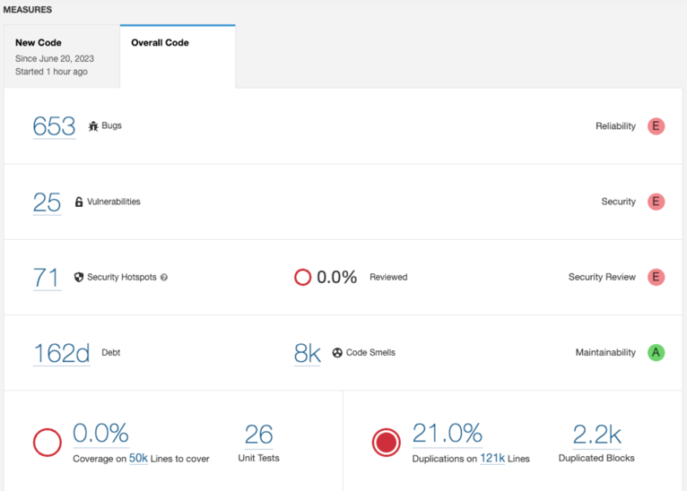

# Jenkins, Gitlab, Sonarqube를 활용한 CI 적용

안정적인 소스 코드 통합을 위해 CI를 적용하였습니다.

## 요약
- serv 원격 저장소에서 develop -> stage로 Merge Request를 생성하면 CI가 실행된다.
- CI에는 빌드 및 정적소스코드분석 빌드가  실행된다.
- 빌드 실패 시 Merge를 할 수 없다.
- 만약 바로 반영해야 하는 건이 있다면 labels에 hotfix를 추가하면 CI를 생략할 수 있다.

## 불안정한 배포

이 전 배포 프로세스는 다음과 같습니다.
1. 개발자가 feature 브랜치에서 작업을 하고 develop으로 Merge Request를 올린다.
2. 리뷰어는 해당 작업에서 변경된 소스 코드를 읽고 피드백 이후에 Merge를 한다.
3. develop -> stage 로 Merge Request를 생성 후 Merge 한다.
4. 개발 서버로 ssh 접속하여 배포 스크립트를 실행한다.

> 만약 1, 2번 과정에서 실수로 빌드가 되지 않는 소스 코드가 반영되면 4번을 하는 과정 중 실패하여 서버가 내려갑니다.

1, 2번 모두 사람이 하는 작업이기 때문에 실수가 발생할 수 있습니다. 4번 과정에서 실수가 발생하면 다시 롤백 후 빌드를 실행하는 최소 3분 최대 10분이 넘는 시간동안 개발 서버가 다운되는 상황이 발생합니다. 이 원인은 다음으로 볼 수 있습니다.
1. 1개의 서버로 실행되고 있다.
2. 롤백을 위한 스크립트 또는 대비책이 존재하지 않는다.
3. 빌드가 실패되는 소스 코드가 올라갔다.

위 3가지 중 제가 해결하고자 하는 원인은 3번 입니다.

## CI 구축

Merge Request를 올렸을 때 빌드를 수행하여 빌드를 실패했을 경우 Merge를 하지 못하도록 한다면 개발자의 실수를 예방할 수 있습니다.
이를 구축하기 위해 Jenkins의 파이프라인으로 구축했습니다. 간략히 설명하면
1. Jenkins에서 트리거 이벤트가 발생하면 빌드를 수행하는 파이프라인을 구축합니다.
2. Gitlab에서는 Merge Request가 생성될 경우 Webhook으로 Jenkins의 트리거 이벤트를 실행하도록 합니다.
3. Jenkins에서 Webhook 정보를 토대로 빌드를 수행하고 빌드가 실패할 경우 Merge를 하지 못하도록 막습니다.

### Gitlab Webhook 설정

> Gitlab Webhook이란?

Gitlab에서 이벤트(Merge Request 생성, Push, 댓글 달기 등)가 발생할 경우 특정 url로 request를 하게 해주는 기능입니다.

Jenkins에서는 트리거를 설정할 때 특정 url을 알려주는데요. 해당 url로 Gitlab Webhook을 만들어주면 됩니다.

- Gitlab Remote Repository -> Settings -> Webhooks -> Add Webhook

### Jenkins 파이프라인

이제 Merge Request가 올라갔을 때 Jenkins의 파이프라인이 실행되도록 구현했으니 파이프라인만 작성하면 됩니다.
이 Jenkins에서는 프리스타일, 파이프라인 2가지 방법이 대중적으로 사용하는데 저는 파이프라인으로 구현하는 방법을 예시로 설명하겠습니다.
1. Merge Request의 source branch 기준으로 빌드를 실행한다.
2. 빌드의 결과값을 기준으로 실패 시 Merge 버튼을 비활성화하는 정보를 Gitlab에 전송한다.
3. 성공 시 Merge 버튼을 활성화하도록 Gitlab에 전송한다.

1번 같은 경우 여러 방법이 있는데 아래 링크에서 값을 가져오는 방법이 서술되어 있습니다.
- [참고링크](https://github.com/jenkinsci/gitlab-plugin#defined-variables)

```java
// pipeline
def sourceBranch = env.gitlabSourceBranch // merge request 시 source branch
def targetBranch = env.gitlabTargetBranch // merge request 시 target branch
```

다른 변수들도 많은데 종종 안불러와지는 변수들도 있습니다.

이제 가져온 값으로 빌드를 실행합니다.

```
// pipeline
        try {
            def buildResult = sh(script: './gradlew build -x test', returnStdout: true)
            addGitLabMRComment comment: "## 빌드 성공! \n - Merge 후 stage 배포를 진행해주세요! → [배포 방법](https://wiki.dev.bankmall.info/ko/개발/deployment/개발_서버_배포)"
            isBuildSuccess = true
            updateGitlabCommitStatus name: 'build', state: 'success'
        } catch (Exception exception) {
            addGitLabMRComment comment: "## 빌드 실패! \n - 로컬에서 `./gradlew build -x test` 를 실행하고 다시 Merge Request 올려주세요!"
            updateGitlabCommitStatus name: 'build', state: 'failed'
        }
```
빌드 결과에 따라 MergeRequest에 댓글을 작성하고 상태를 바꿔주는 로직입니다. 댓글을 작성하는 메서드는 Jenkins 파이프라인 작성하는 곳 아래에 `Pipeline Syntax` 를 참고했습니다.


## Sonarqube

추가로 빌드 후 정적소스코드분석도 하도록 구현해보았습니다. 이는 지속적인 통합을 하면서 버그 청소 및 코드에 대한 분석을 바탕으로 클린코드를 작성하는데 도움이 된다고 생각하여 적용했습니다.

```
        if (isBuildSuccess) { // 빌드가 성공할 경우 실행
            try {
                def buildResult = sh(script: "./gradlew sonar -Dsonar.projectKey=develop -Dsonar.projectName=develop -Dsonar.host.url=${sonarqubeUrl} -Dsonar.token=${sonarqubeToken}", returnStdout: true)
                addGitLabMRComment comment: " ## 정적 소스 코드 분석 성공!  \n 리뷰어에게 코드리뷰를 요청하기 전 아래 링크로 접속하여 분석 결과를 확인해주세요. -> [소스 코드 분석 결과](${sonarqubeResultUrl})"
            } catch (Exception exception) {
                addGitLabMRComment comment: " ## 정적 소스 코드 분석 실패!  \n 담당자(최우석)에게 Merge Request url을 전달해주시면 감사하겠습니다!"
            }
        }
```

빌드가 성공할 경우 소나큐브 빌드를 실행하고 결과에 따라 Merge Request에 댓글을 남기는 로직입니다.


정적 소스 코드 분석에 성공하면 결과 페이지로 넘어갈 수 있습니다.

!

## CI 구축으로 인해 기대하는 부분
- 개발자의 실수를 초기에 잡아준다.
- 정적 소스 코드 분석 데이터를 바탕으로 버그가 될만한 코드 또는 더 좋은 방법으로 코드를 개선한다.
- CI 구축을 시작으로 운영 배포까지 자동화 구축을 하면서 개발팀원들의 개발 환경을 개선한다.
