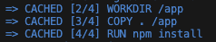
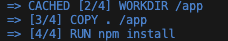

## 개요

도커의 이미지 레이어를 활용하여 반복되는 배포 과정에서 빌드 속도를 개선했던 방법에 대해 기술되어 있습니다.

## 들어가기 전

이 글의 주제에 대해 설명드리기 전에 알고 있어야 하는 개념에 대해 설명드리겠습니다.
- 도커와 컨테이너
- 컨테이너와 이미지
- 간단한 실습

## 도커와 컨테이너
도커를 이해하려면 컨테이너라는 개념과 같이 이해해야 합니다.
도커는 컨테이너를 생성하고 관리하는 도구입니다. 여기서 컨테이너란, 표준화된 소프트웨어 유닛입니다. 기본적으로 코드 패키지이며 해당 코드를 실행하는데 필요한 종속성과 도구가 포함되어 있습니다. 다시 이야기하자면, 컨테이너는 애플리케이션을 구동하는데 필요한 실행환경, 라이브러리, 소프트웨어, 시스템 도구, 코드 등을 표준화된 단위로 추상화한 개념입니다. 도커는 이 컨테이너를 생성하고 관리하는 도구입니다.

### 도커의 장점
> 독립된 환경으로 애플리케이션을 관리할 수 있습니다.

다른 환경을 가지는 프로젝트들을 컨테이너라는 표준화된 단위로 관리할 수 있습니다. 예를 들어 NodeJS 버전이 14인 프로젝트와 16인 프로젝트를 하나의 서버에서 구동하고 있다고 생각해봅시다. 둘 간의 호환성이 괜찮아 16 버전으로도 14인 프로젝트를 구동할 수 있다면 좋곘지만, 아닌 경우가 발생할 수 있습니다. 이럴 경우 nvm 같은 버전 관리 도구와 함께 각 애플리케이션의 배포 스크립트를 작성하고 배포를 진행해야 합니다. 도커에서는 이 환경 마자 하나의 컨테이너로 관리할 수 있습니다. 현재 os가 어떤 버전을 가지고 있더라도 컨테이너는 독립된 환경에서 소스 코드를 실행하기 때문에 영향을 받지 않습니다.

## 컨테이너와 이미지
이미지는 모든 설정 명령과 모든 코드가 포함된 공유 가능한 패키지입니다. 실제로 코드와 코드를 실행하는데 필요한 도구를 포함합니다.\
이미지를 구동하고 실행한 것을 컨테이너라고 부릅니다. 즉, 이미지는 컨테이너의 템플릿, 블루프린트 같은 역할을 합니다.\
이미지는 직접 만들수도 있고 외부에 있는 이미지를 가져올 수 있습니다. git을 사용할 때 github을 통해 다른 사람의 소스 코드를 가져올 수 있듯 docker에서도 Docker Hub에서 공유된 이미지를 가져와서 사용할 수 있습니다.

## Dockerfile로 이미지 생성하기
```Dockerfile
FROM node # 환경 설정

WORKDIR /app # 작업 공간

COPY . /app # 현재 디렉토리에 있는 모든 소스 코드를 /app에 복사

RUN npm install # 노드 모듈 설치

EXPOSE 80 # 내부 80포트로 실행

CMD ["node", "server.js"] # 컨테이너 실행 시 실행할 명령어
```
정말 간단한 NodeJS 애플리케이션의 도커 이미지를 만들 수 있는 Dockerfile 입니다. NodeJS 애플리케이션 root 디렉토리에 위 Dockerfile을 생성하고 실행하면 docker image가 생성됩니다.
```shell
docker build . // Dockerfile이 있는 위치에서 실행
docker images // docker image 조회
```

### 이미지 빌드 시 캐시 기능


똑같은 Dockerfile을 한 번 더 빌드하면 이전보다 빠르게 이미지가 생성되는 것을 알 수 있습니다. 이유는 도커에서 이미지를 생성할 때 캐시로 저장하고 있기 때문입니다.

### 소스 코드에 수정이 발생하면?



WORKDIR /app 까지 캐시된 내용을 가져오고 이 후에는 캐시를 사용하지 못하는 것을 확인할 수 있습니다. 이유가 무엇일까요?

## 이미지 레이어
도커는 모든 명령 결과를 캐시하고 이미지를 다시 빌드할 때 명령을 다시 실행할 필요가 없으면 이러한 캐시된 결과를 사용합니다. 이것을 `레이어 기반 아키텍처`라고 합니다.\
모든 명령은 Dockefile의 레이어를 나타냅니다.
`WORKDIR /app` 명령인 레이어까지는 변경되지 않았기 때문에 캐시된 내용을 가져올 수 있지만, `COPY . /app` 같은 경우는 소스 코드가 변경되었기 때문에 캐시를 사용할 수 없습니다.\
여기서 확인할 점은 `COPY . /app` 이후 명령어인 `RUN npm install`도 캐시를 사용하지 않았습니다. 도커는 이전 명령에서 소스 코드가 바뀌었다는 것을 감지했기 때문에 다음 명령어가 동일한 결과를 산출할지 알 수 없습니다. 따라서 다음 레이어들도 다시 실행하게 됩니다.

## 도커로 빌드 속도 개선하기
다시 주제로 돌아와서 그럼 어떻게 빌드 속도를 개선할 수 있는걸까요?

> 로그인을 할 경우 `환영합니다` 로 문구를 수정해주세요.

프론트엔드 개발자가 이런 요구사항을 만날 경우 다음과 같은 과정을 밟습니다.
1. 소스 코드에 있는 문구를 수정하고 원격저장소에 push 한다.
2. 배포하고 있는 서버에서 바뀐 소스 코드 형상을 반영한다.
3. 바뀐 소스 코드를 기준으로 이미지를 생성한다.
4. 기존 컨테이너를 제거하고 새로운 이미지로 새로운 컨테이너를 실행한다.

```Dockerfile
FROM node

WORKDIR /app

COPY . /app

RUN npm install

EXPOSE 80

CMD ["node", "server.js"]
```

앞서 설명했 듯 위 구조라면 문구가 바뀌면서 `COPY . /app` 레이어부터 캐시를 사용하지 못하고 재실행하는 것을 알 수 있습니다. 결국 문구만 바뀌었을 뿐인데 다시 `npm install`을 실행하여 노드 모듈을 재설치하도록 되어 있는 비효율적인 방법을 사용하고 있습니다.

### 개선 방법

```Dockerfile
FROM node

WORKDIR /app

COPY package.json /app # 노드 모듈 설정 파일만 복사

RUN npm install # 순서 바뀜

COPY . /app # 순서 바뀜

EXPOSE 80

CMD ["node", "server.js"]
```

`RUN npm install` 과 `COPY . /app`의 순서를 바꾸면 비효율적인 구조를 개선할 수 있습니다. 문구만 수정할 경우 `RUN npm install` 까지 레이어는 변함이 없기 때문에 docker에서 캐시된 레이어를 사용합니다. 만약 `package.json`의 내용이 수정된다면 그 아래 레이어도 재실행되기 때문에 이미지 생성 시 노드 모듈을 재설치하도록 구성할 수 있습니다.

## 결론
도커에서 이미지를 생성할 때 빌드를 최적화하는 방법에 대해 설명드렸습니다. 매우 간략한 예시를 들었지만, 실제 프로젝트에서 노드 모듈 같은 라이브러리를 설치할 때 드는 비용과 시간은 생각보다 오래 걸립니다. 이미지의 레이어에 대한 내용을 이해하고 적용한다면 노드 뿐만 아닌 다른 애플리케이션을 배포할 때에도 자원을 절약하고 빠르게 빌드할 수 있습니다.

### 참고

- [hudi.blog](https://hudi.blog/about-docker/)
- [【한글자막】 Docker & Kubernetes : 실전 가이드](https://kmooc.udemy.com/course/docker-kubernetes-2022/)
