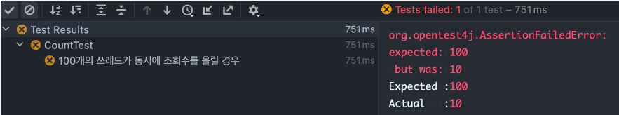

## 조회수 카운트 로직과 멀티 쓰레드

사용자가 우리 앱에 접속할 때 마다 조회수를 +1씩 해주는 api가 있다고 가정해봅시다.

```java
// StaticCountService

@Transactional
public void updateVisitCount() {
	StaticCount staticCount = staticCountRepository.findByCode("메인 페이지 코드").get();
	staticCount.setCount(staticCount.getCount() + 1); // 트랜잭션 커밋 시 변경 감지로 update 쿼리 발생
}
```

메인 페이지에 접속했을 때 실행되는 메서드로 메인 페이지 조회수를 조회하고 +1을 하여 update 쿼리를 날리는 로직입니다.
만약 여러 사용자가 동시에 메인 페이지에 접속한다면 어떤 일이 발생할까요?

## Spring Boot(Tomcat)은 멀티 쓰레드 환경이다.

Spring Boot로 애플리케이션을 구축하면 기본적으로 톰캣을 사용하기 때문에 java의 Thread 처럼 사용자 요청마다 쓰레드 풀에서 쓰레드를 사용하게 됩니다. 100명의 사용자가 메인 페이지에 접속하면 100개의 쓰레드가 위 메서드를 실행하게 됩니다.

### 테스트

```java
@DisplayName("100개의 쓰레드가 동시에 조회수를 올릴 경우")
@Test
void updatePlus() throws InterruptedException {
    // given
    StaticCount count = new StaticCount("메인 페이지", 0); // 메인 페이지 조회수 초기화
    countRepository.save(count);
    Long id = count.getId();

    // when
    int numberOfThreads = 100; // 100개의 쓰레드
    ExecutorService service = Executors.newFixedThreadPool(numberOfThreads);
    CountDownLatch countDownLatch = new CountDownLatch(numberOfThreads);

    for (int i = 0; i < numberOfThreads; i++) { // 100개의 쓰레드를 할당하고 실행
        service.execute(() -> {
            try {
                staticCountService.updateVisitCount(id); // Count 도메인 내부에 int 필드값을 +1 을 지연로딩으로 처리
            } catch (InterruptedException e) {
                e.printStackTrace();
            } finally {
                countDownLatch.countDown(); // countDownLatch - 1
            }
        });
    }

    countDownLatch.await(); // countDownLatch.countDown()이 100번 호출될 때까지 대기
    // then
    Count actual = countRepository.findById(id).get();
    assertThat(actual.getNumber()).isEqualTo(numberOfThreads); // 100번의 조회수가 count 됐는지 확인
}
```
`ExecutorService` 를 사용하여 간단하게 멀티 쓰레드 환경을 구축하여 테스트를 진행했습니다.



100번의 조회수가 올라야 하는데 고작 10번밖에 되지 않은 상황을 볼 수 있습니다.

## 이유

1. 트랜잭션 시작
2. 조회수 조회
3. 조회수 업데이트(+1)
4. 커밋(롤백)

한 쓰레드에서 1번~3번까지 진행했을 때 다른 쓰레드에서 2번을 진행하면 어떻게 될까요?
쓰레드에서 업데이트하기 전 데이터를 조회하게 됩니다. 예를 들어 10 -> 11로 올리고 있을 때 커밋되지 않는다면 다른 곳에서 조회하면 11이 아닌 10을 조회하고 똑같이 11로 업데이트를 하게 됩니다.

## 해결 방법
### synchronize
```java
// StaticCountService

@Transactional
public synchronized void updateVisitCount() {
	StaticCount staticCount = staticCountRepository.findByCode("메인 페이지 코드").get();
	staticCount.setCount(staticCount.getCount() + 1); // 트랜잭션 커밋 시 변경 감지로 update 쿼리 발생
}
```

테스트를 실행해보면 실패하게 됩니다. `@Transactional` 이 붙은 메서드일 경우 제대로 실행되지 않게 됩니다.
이유는 `@Transactional` 이 붙으면 위 코드 앞 뒤로 트랜잭션에 관련된 코드가 붙고 이를 실행하기 때문입니다.

```Java
// StaticCountServiceProxy

@Transactional
public synchronized void updateVisitCount() {
	// 트랜잭션 코드
	staticCountService.updateVisitCount();
  // 커밋 or 롤백
}
```

위 코드에서 `staticCountService.updateVisitCount()`는 동기적으로 실행할 수 있을지라도 다른 코드는 동시에 실행되기 때문에 만약 커밋, 롤백 전에 다른 곳에서 코드를 실행하게 되면 똑같이 동시성 문제가 발생할 수 있습니다.

### 비관적 락
```sql
SELECT * FROM table_name WHERE condition FOR UPDATE;

```
처음 조회할 때 비관적 락을 사용하게 되면 동시 요청을 
serializable 하게 실행시킬 수 있어 테스트를 통과할 수 
있습니다. 단, 그만큼 동시성 성능을 포기하기 때문에 권장하는 방법이 아닙니다.

### 쿼리 변경
조회 후 애플리케이션 내에서 변경 감지로 update 쿼리를 날리는 것이 아닌 바로 update 쿼리를 날리는 것 입니다.
```sql
UPDATE static_count SET count = count + 1 WHERE static_count_id = ?
```
```java
// StaticCountRepository
@Modifying
@Query("update StaticCount c set c.number = c.number + 1 where c.code = :code")
int updatePlus(@Param("code") String code);
```
```java
// StaticCountService

@Transactional
public synchronized void updateVisitCount() {
	staticCountRepository.updatePlus("메인 페이지");
}
```

위 처럼 코드를 수정하면 테스트는 통과합니다.
